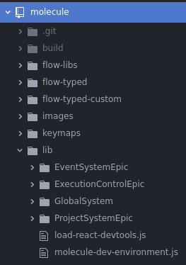

# Project structure

## Folder structure

The folders are:

* `build/`: The target folder for Babel transcompilation.
* `flow-*/`: Additional information needed for Flow type-checking. You probably won't need to worry about it.
* `images/`: Stores the README images and the plugin icons.
* `keymaps/`: Keybindings for Molecule commands.
* `lib/`: The actual source code.

Molecule's code is sorted into thematic folders: Epics and Features, named
after
[the Atlassian Scrum terminology](https://www.atlassian.com/agile/project-management/epics-stories-themes).

> **Warning**: do not be confused between Agile Epics and redux-observables Epics. We'll use the term "Epic" with the Agile meaning in this section.

### Epics

An Epic is a set of Features. We can think of Epics as representing different
functions of an IDE (text edition, tools execution, project management, etc).

There are four epics:

- **EventSystemEpic**: handles the file events.
- **ExecutionControlEpic**: handles tools execution.
- **ProjectSystemEpic**: handles management of projects.
- **GlobalSystem**: handles the glue code and composition roots, linking the others together.

### Features

Features are the basic units of functionality in the code. Features are the
different things you'd describe to explain what Molecule adds to Atom. "It adds
a console, a terminal, code diagnostics, etc".

Features all follow the same folder structure, based on the Redux workflow.

They can contain:

- `Actions/`: which contains redux action creators
- `Reducers/`: which contains redux reducers
- `Selectors/`: which contains some utils to select data from the related state
- `Containers/`: which contains react components which take data from the state and send them as props
- `Presenters/`: which contains visual components
- `Epics/`: which contains redux-observable epics handling I/O events
- `Types/`: which contains consts, flow types and immutable Records
- `Fake/`: which contains fake data for unit testing
- `Styles/`: which contains some variables related to the UI
- `Layouts/`: which contains some old visual components
- `AtomLinks/`: which contains the functions that mount react components (ReactDOM.render) on Atom elements.
- `Model/`: which contains core functions for data management
- `Process/`: which contains files being launched as child processes

## Atom's package system

Molecule is an Atom package. When Atom starts, it runs the methods declared in
Molecule's package object, exported in the `lib/molecule-dev-environment.js`
file.

That object has two important fields: **config**, which lists custom settings
that the user can edit, and **activate**, which runs Molecule (loads plugins,
loads package files, creates React roots, etc).

## React and Redux

The project uses the [Redux](https://redux.js.org/) architecture for
representing state, which is inspired by Facebook's
[Flux](https://facebook.github.io/flux/docs/in-depth-overview.html#content), and
the [React](https://reactjs.org/) library for rendering. They help guarantee
that the rendering code is always straightforward and bug-free.

If you're not familiar with React, Flux or Redux, the gist of it is, we store
the entire state of our application (plugins loaded, tasks being executed, etc)
in a **State** object handled by a specific construct (call the Redux Store).
This State is passed as a parameter to **Views**; functions that
take the State (but don't modify it) and return the DOM objects that Molecule
must display, using React's syntax and API.

The State can never be modified directly; instead a new state is generated by
the Store when it receives **Actions**. Actions are dispatched by Views when the
user interacts with Molecule, and by **Redux Middleware** after I/O events (eg a
task is done running). These actions are passed as parameters to **Reducers**,
which take the Action and the previous State as parameters, and return the
new state.

To summarize:

* **State**: the entire current state of Molecule.
* **Views**: functions returning what Molecule must display.
* **Actions**: messages sent to change the State.
* **Reducers**: functions returning the new state after an action is dispatched.
* **Redux Middleware**: constructs handling I/O events.

These concepts match different parts of Molecule's folder structure.

### State

When the Redux Store is created, the State is defined as the default value
returned by Reducers. Its definition is spread between `SomeFeature/Reducers/`
folders and `OtherFeature/Types/` folders.

Its composition root is `lib/GlobalSystem/Reducers.js`.

### Views

Views are defined in `SomeKindOfFeature/Presenters/` folders. They're called
are called from **Containers**, which convert State for Redux data into
React-compatible arguments; they're defined in `GreatFeature/Containers/`
folders.

They are rendered into DOM objects in:
- `lib/ExecutionControlEpic/ControlPanelFeature/AtomLinks/Panels.js`
- `lib/ExecutionControlEpic/DevToolsSummaryFeature/AtomLinks/Panels.js`
- `lib/ExecutionControlEpic/QuestionSystemFeature/AtomLinks/Layouts.js`

### Reducers

Reducers are defined in `SomeFeature/Reducers/` folders.

Their composition root is `lib/GlobalSystem/Reducers.js`.

### Actions

Actions are defined in `SomeFeature/Actions/` folders.

They're dispatched by the `dispatch` callback in Containers, and by Redux
Middleware in `OtherFeature/Epics/` folders.

### Redux-Observable Epics

[Redux-Observable documentation](https://redux-observable.js.org/l) is a
Middleware used by Molecule. It relies on **Epics** (not to be confused with
Agile Epics), which are functions taking a
[RxJs Observable](http://reactivex.io/documentation/observable.html) of
actions, and returning an Observable of new actions.

Redux Epics handle I/O events when an actions is dispatched. For instance, when
the user presses the "Run task" button, a **RUN_TASK** action is dispatched; the
[Tasks.js](https://github.com/alanzanattadev/atom-molecule-dev-environment/tree/master/lib/ProjectSystemEpic/LanguageServerProtocolFeature/Epics/Tasks.js)
epic is called, and actually runs the Task; it returns the different actions
emitted by that task.

Redux Epics are defined in `SomeFeature/Epics/` folders. Their composition root
is `lib/GlobalSystem/Epics.js`.

## Non-Redux states

Redux handles all the state which is serializable and linked to the UI. For all
the non-serializable states (as terminal instances or network connections),
separate stores are created. Those stores are simple maps or lists encapsulated
in a class. This class is generally named "SomethingController".

### Execution

Each running process is linked to a structure called Execution with its task identifier. The role of the execution is to handle process specific state (eg: instance of terminal) and process specific events (eg: terminal resizes). Executions are then stored in a class called ExecutionController.

When an event (eg: a new terminal output) notifies the Core through LSP messages, Molecule's Core can get the corresponding execution with the task ID, and send the new output to the terminal instance this way.
