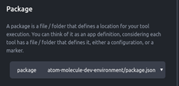
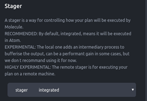

When starting Atom, your screen should look somewhat like this:

*Note: for the sake of this tutorial, we are browsing [the Molecule repository](https://github.com/alanzanattadev/atom-molecule-dev-environment/)*

The main addition is the **Plugin Bar** at the bottom of the screen. Each round
icon represents a plugin; Molecule is shipped with
[a bunch of default plugins](./default-plugins.md), and you can add third-party
plugins through `apm`.

[Comment]: # (TODO - Add third-party Molecule plugin as an example)

To execute these plugins, you need to create a **Molecule plan**. A plan is a
reusable action that uses a given plugin with pre-registered parameters. For
instance, you can create a plan for the NPM plugin that will always call
`npm run start`.

Create a new plan
-----------------

When you click on the name under one of the plugin icons, a panel titled
**Plan configuration** should open on your right.

This panel displays a list of settings specific to each plugin. You can tweak
the settings' values, then click "Create" to add a plan.

For this tutorial, we will create an eslint plan:

- Hover on the Eslint icon, then click on the "Eslint" text that appears under,
- Set name to "eslint_0",
- Leave the other settings as-is
- Click the "Create" button.

A new plan named "eslint_0" should have appeared at the bottom of your window. You
can click on this plan, which will run `jest` and start giving you diagnostics.

### Package system

The plugin bar doesn't display every Molecule plugin. Instead, Molecule adapts
to the current project by only display tools the project actually uses.

Molecule decides which tools the project uses by browsing for files that we call
**Packages**. For instance, if the project directory has an `.eslintrc` file,
then Molecule considers that the project uses the Eslint tool, and displays the
Eslint plugin in the plugin bar.

Which files count as a package varies from plugin to plugin. Most Node.js
plugins consider `package.json` to be a package file if the corresponging tool
is installed in `node_modules`.

When creating a new plan, one of the configuration settings for all plugins is
"package". If the project includes several package files for the current plugin
(for instance, if the project has several folders with `package.json` files
when creating an Eslint plan), then the "package" setting allows you to choose
which package the plan will use.

### Stager

The stager setting allows you to pick a **Stager** for your plan. The stager
allows you to decide how the plan will be executed: locally, or on a distant
machine.

Most of the time, leaving the default value is fine; you only need to execute
your plan locally.
