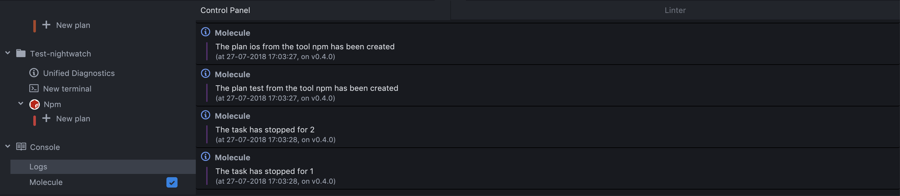

To keep track of what is happening in your project, Molecule provides
a console giving you a quick overview of all events happening in Molecule.

To access the Console, scroll down to the bottom of the 
[Plan sub-panel](getting-started-using-a-plan.md#plugin-sub-panel)
to find the **Console** section. To see the logs, simply click the **log** button.

The log panel lists the event emitted by your project. There is a icon next to them
defining the severity of the log. The severity mirror the severity of the diagnostics
and are:

- Error
- Warning
- Info
- Hint
- Success

Event logged
------------

Molecule automatically logs the following events:

- Plan creation and deletion (including auto-generated plans) ;
- Plan start/stop/kill/crash ;
- The experimental features that are enabled ;

More events will be added in the future.

Source filtering
----------------

Molecule allows you to select which source you want to display in the Console.
Below the Console button you'll find a list of source providing messages to the
console. You can check the checkbox next to them to enable or disable the sources.

**Info**: for now, the only source supported by Molecule is Molecule itself. This
will be extended in future versions and an API might be provided to external packages
to publish their messages in the Console.
