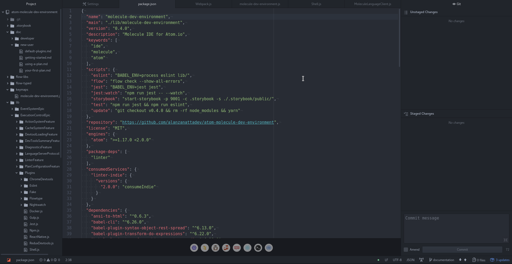
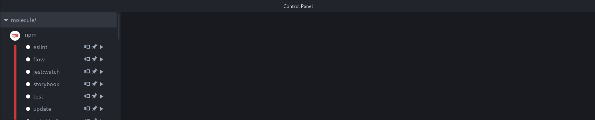
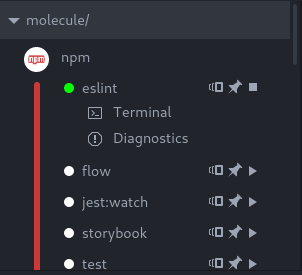
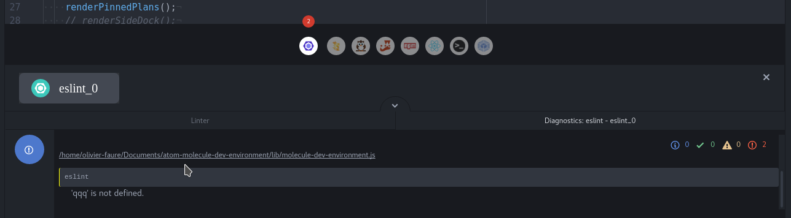
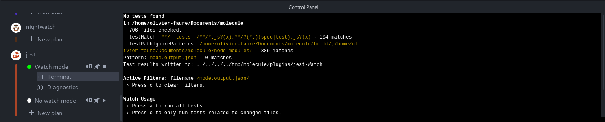

When starting Atom with Molecule, your screen should look somewhat like this:

*Note: for the sake of this tutorial, we are browsing
[the Molecule repository](https://github.com/alanzanattadev/atom-molecule-dev-environment/)*

The main addition of Molecule is the **Control Panel**, which is located at the bottom of
the screen by default. It allows you to control the execution of tools on your project through plugins,
and offers you an easy-to-read, fancy view of their output.

On the left of this panel is the **plugin panel**.

Plugin Panel
---------------

The plugin sub-panel displays a list of Molecule plugins available for tools
the project actually uses. Plugins related to technologies not used in the project
are hidden.

Molecule decides which tools the project uses by browsing for files that we call
**Packages**. For instance, if the project directory has an `.eslintrc` file,
then Molecule considers that the project uses the Eslint tool, and displays the
Eslint plugin in the Plugin Panel.

Which files count as a package varies from plugin to plugin. Most Node.js
plugins consider `package.json` to be a package file if the corresponging tool
is installed in `node_modules`.

### Plans

To execute these plugins, you need to create a **plan**. A plan is a
configuration that executes a given plugin with pre-registered parameters. For
instance, you can create a plan for NPM that will always call `npm run start`.

Each plugin is displayed with a list of  pre-generated plans and an option to
[create a new plan](getting-started-creating-a-plan.md).

Each plan is displayed with three buttons:

- A **Split** button that will split the Control Panel in two part and will open the
plan in the newly created Control Panel. This allow you to see multiple plans at the
same time, and easily move the Control Panel wherever you want in Atom.

- A **Pin** button, that adds the plan to a list of "pinned" plans displayed above
the Control Panel.

- A **Play** button that runs/stops the execution of the plan.

When started, two additional buttons should appear under the plan name.

- The Diagnostics button opens the [Diagnostics Panel](#diagnostics-panel).

- The Terminal button opens the [Terminal Panel](#terminal-panel).

#### Watch Mode

Some plan can be run in "watch mode". The watch mode allow a tool to
run in the background and check your files when modifications are saved.
A typical example is testing tools: every time you edit a file, it will
run the test suite of your project to ensure that you did not broke anything.

Most of the "watch mode" plans available for your project (such as test,
static analysis, linter, ...) are automatically executed on startup.

Diagnostics Panel
--------------------

All Molecule plugins have the same workflow:

* They analyse your project's files to find the files they are interested by ;
* They execute some operation on these files (analyse, testing,...) ;
* They output a stream of messages to describe their result ;

These messages are called **Diagnostics**, and can be accessed in the
**Diagnostics Panel**.

Once you've executed a plan, the Diagnostics Panel will start to be
filled of Diagnostics. There are several types of them, with different colors:

- Errors
- Warnings
- Information
- Hints
- Successes

For most plugins, diagnostics are only sent if you do something wrong. They
indicate syntax errors, code smells, test failure, etc.

Clicking on a diagnostic will jump to the code it concerns. For
instance, clicking on a syntax error diagnostic will open the relevant file, and
place your cursor at the line of the error.

### Filtering diagnostics

Molecule allows you to easily filter the diagnostics of your project.
You can either hide by severity by clicking on the corresponding icons, next to which
the number of diagnostics with this severity is displayed, or by searching for
a specified term.

In the later case, the search will be performed on the diagnostic content and only
the ones corresponding to your search will be displayed. It can be used to show
diagnostics only for a specific file or subject.

To clear the search, you just have to click on the `x` icon next to the search bar.

To show the diagnostics that were hidden, simply click again on the severity icon.
When enabled, the number of diagnostics corresponding to this severity will be displayed.

### Unified Diagnostics

When working with different tools at the same time, it can be useful to get a summary of
all diagnostics for the project. Molecule provides you the **Unified Diagnostics** panel
to do that.

The Unified Diagnostics panel is accessible from the top of the Control Panel. It works
in the same way as plugins' diagnostics panels except that it summarise all diagnostics
in the project. You can therefore [filter them](#filtering-diagnostics) to have a general
overview of the project, or see the diagnostics for a specified term or file.

Terminal panel
--------------

Most Molecule plugins use a command-line tool. For instance, the Eslint plugin
is based on the `eslint` CLI.

While plugins transform the text these commands output into a more readable
format, sometimes you may want to read the raw output directly. You achieve this by
by clicking on the **Terminal** button to switch to the **Terminal Panel**.

Some tools may need user interaction to work (by entering some text or password for
example) and the terminal allows you to easily do this. However, please note that if
the tool does not ask for interaction, you won't be able to do anything with the terminal
except reading it.
